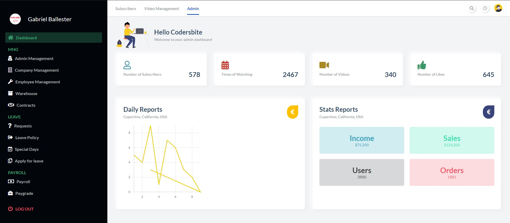
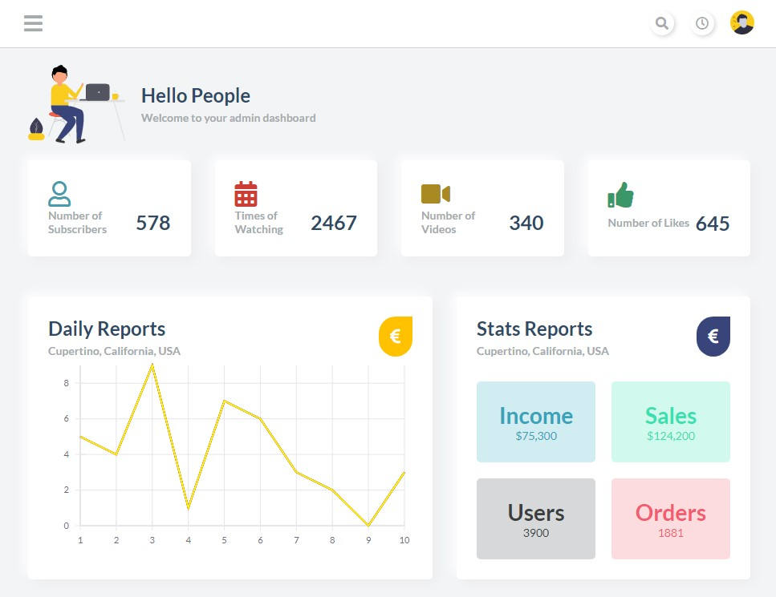
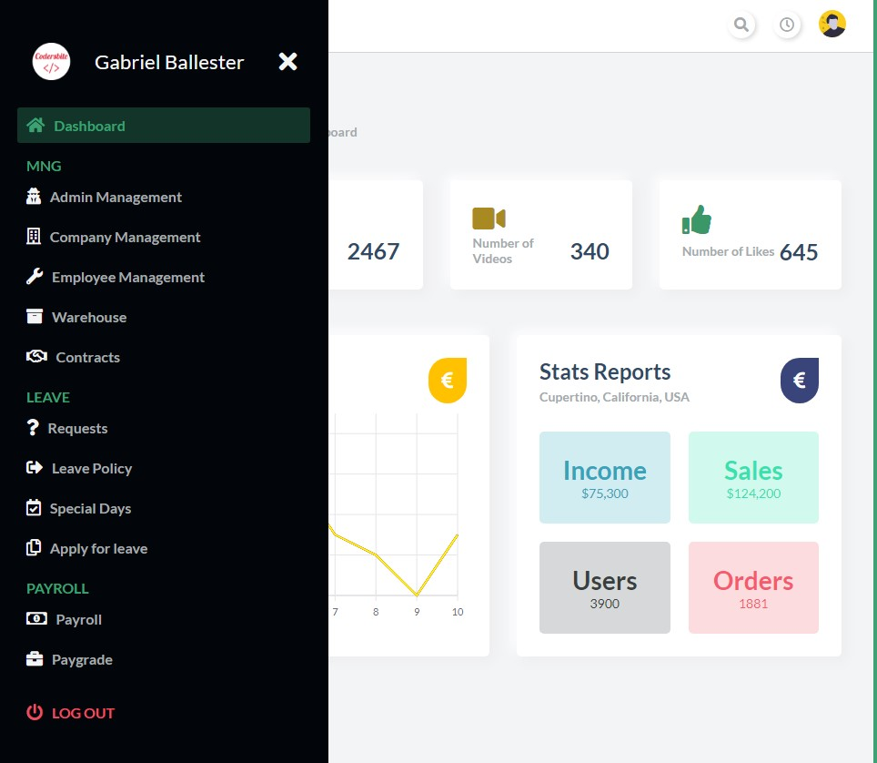
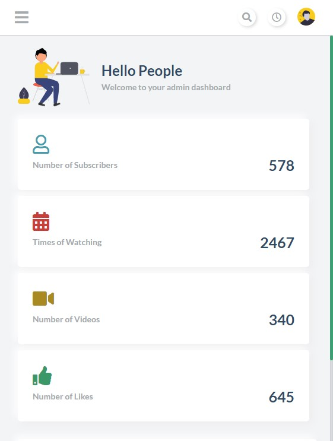
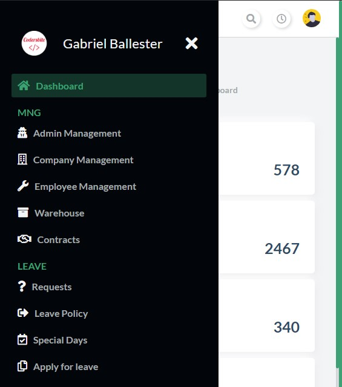

# React panel de administración "CSS responsive" (desktop, mobile, tablet")
Panel de administración "responsive: mobile & tablet friendly" con react y sidebar ocultable/mostrable
## Tecnologías usadas:
- React
- CSS Grid

## Instalar dependencias
`yarn install`

## Arrancar servidor
`yarn start`

Arranca en modo desarrollo
Abre [http://localhost:3000](http://localhost:3000) para mostrar el diseño

## Capturas
### - Escritorio

### - Tablet

### - Tablet (sidebar desplegado)

### - Mobile

### - Mobile (sidebar desplegado)
