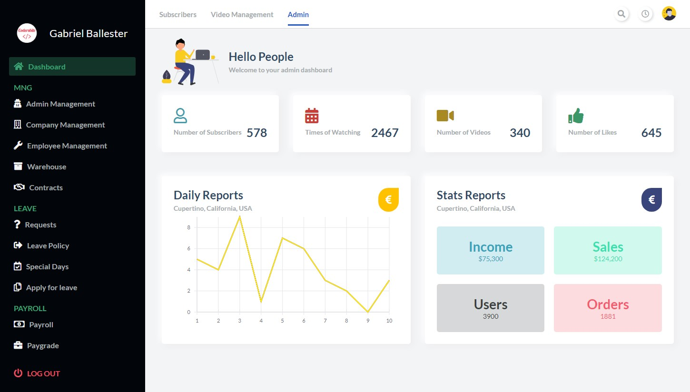

# React panel de administración "mobile friendly"
Panel de administración "mobile friendly" con react y sidebar ocultable-mostrable en modo mobile
## Tecnologías usadas:
- React
- CSS Grid

## Instalar dependencias
`yarn install`

## Arrancar servidor
`yarn start`

Arranca en modo desarrollo
Abre [http://localhost:3000](http://localhost:3000) para mostrar el diseño

## Capturas
### - Escritorio

### - Mobile

### - Mobile (sidebar desplegado)

